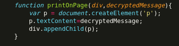

# Lab4Cripto
Laboratorio 4 Cripto Tampermonkey Cifrado y HTTP
## Código usado: https://jumpshare.com/s/XkvrLlS9zf9aGE3wQJnQ
```
// ==UserScript==
// @name         Script Cripto Final
// @namespace    http://your.namespace.com
// @version      0.1
// @description  Desencriptar mensaje en pagina LAB4
// @author       Martin Sepulveda Quintanilla
// @match        https://cripto.tiiny.site/
// @require      https://cdnjs.cloudflare.com/ajax/libs/crypto-js/4.2.0/crypto-js.min.js
// @resource cryptojs https://cdnjs.cloudflare.com/ajax/libs/crypto-js/4.2.0/crypto-js.min.js
// @resource integrity sha384-mgWScxWVKP8F7PBbpNp7i/aSb17kN0LcifBpahAplF3Mn0GR4/u1oMpWIm2rD8yY
// @grant        none
// ==/UserScript==

(function() {
    'use strict';

    function decryptTripleDES(key, encryptedMessage) {
        var ciphertext = CryptoJS.enc.Base64.parse(encryptedMessage);
        var des3Key = CryptoJS.enc.Utf8.parse(key);

        var decryptedBytes = CryptoJS.TripleDES.decrypt({
            ciphertext: ciphertext
        }, des3Key, {
            mode: CryptoJS.mode.ECB,
            padding: CryptoJS.pad.Pkcs7
        });

        var decryptedText = decryptedBytes.toString(CryptoJS.enc.Utf8);
        return decryptedText;
    }

    function printOnPage(div, decryptedMessage) {
        var p = document.createElement('p');
        p.textContent = decryptedMessage;
        div.appendChild(p);
    }

    function decryptAndPrintMessages() {
        var text = document.body.textContent;
        var sentences = text.match(/[^\.!\?]+[\.!\?]+/g);
        var extractedLetters = '';

        sentences.forEach(function(sentence) {
            var firstLetter = sentence.trim().charAt(0);
            extractedLetters += firstLetter;
        });

        console.log("La llave es: " + extractedLetters);

        var divsWithMxClass = document.querySelectorAll('div[class^="M"]');
/*
        for (let i = 0; i < Math.min(divsWithMxClass.length, 3); i++) {
            let div = divsWithMxClass[i];
            switch (i) {
                case 0:
                    div.id = 'cxestT/hagc=';
                    break;
                case 1:
                    div.id = 'wm7tyxSlPz4=';   //DESCOMENTAR PARA PROBAR CON 3 MENSAJES DISTINTOS
                    break;
                case 2:
                    div.id = '1aMgsOiR90U=';
                    break;
                default:
                    break;
            }
        }

        for (let i = 3; i < divsWithMxClass.length; i++) { //Cambiar el 3 al numero de mensajes a probar
            divsWithMxClass[i].parentNode.removeChild(divsWithMxClass[i]);
        }
        divsWithMxClass = document.querySelectorAll('div[class^="M"]');
*/
        console.log("Los mensajes cifrados son: " + divsWithMxClass.length);

        divsWithMxClass.forEach(function(div) {
            var encryptedMessage = div.id;
            var decryptedMessage = decryptTripleDES(extractedLetters, encryptedMessage);
            console.log(encryptedMessage + ": " + decryptedMessage);
            printOnPage(div, decryptedMessage);
        });
    }

    if (document.readyState === 'loading') {
        document.addEventListener('DOMContentLoaded', decryptAndPrintMessages);
    } else {
        decryptAndPrintMessages();
    }
})();
```
# Imágenes en orden





#Screenshots Extra


